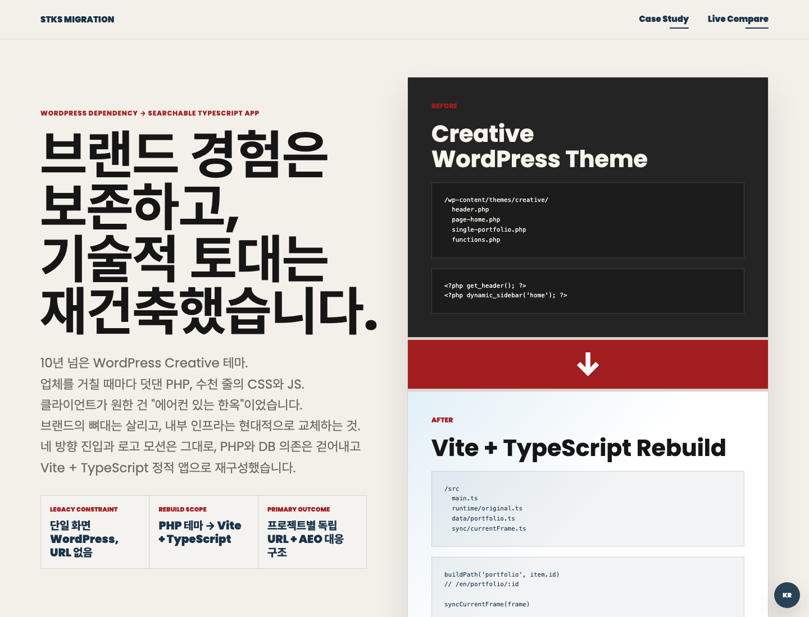
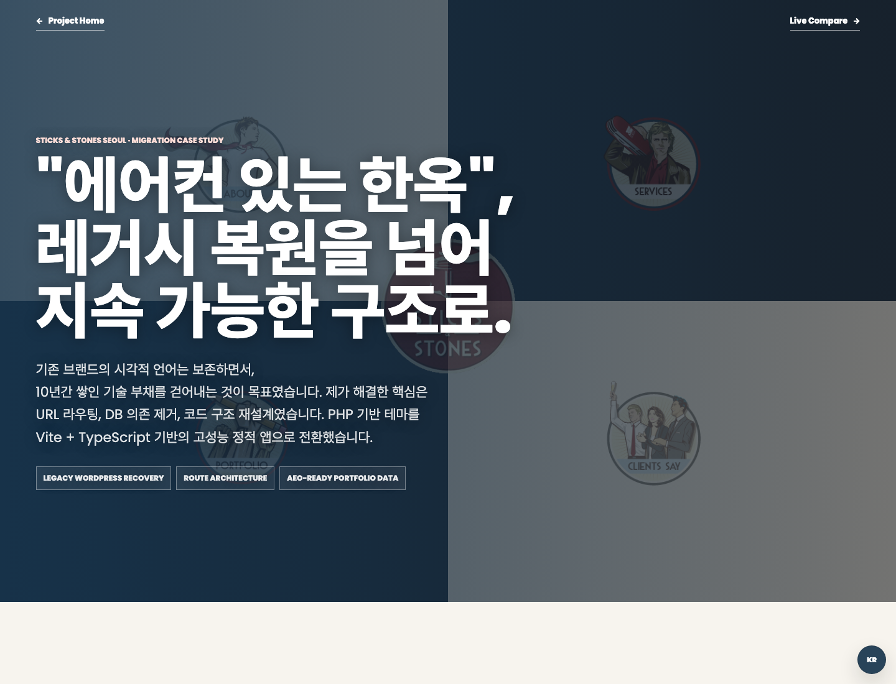
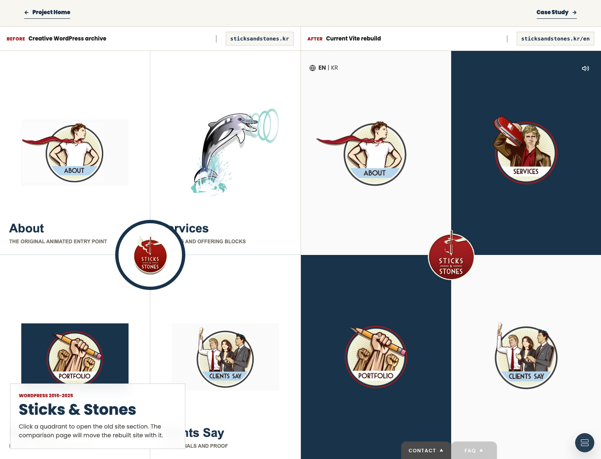
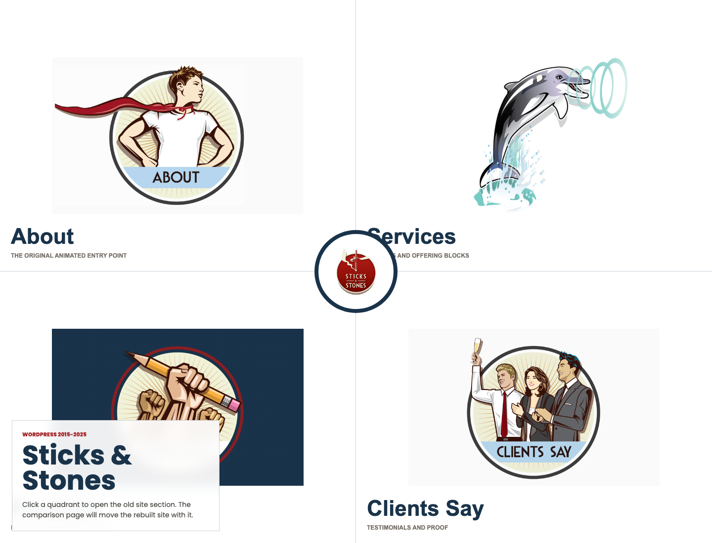
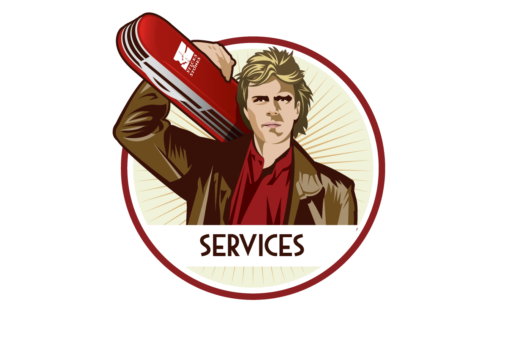
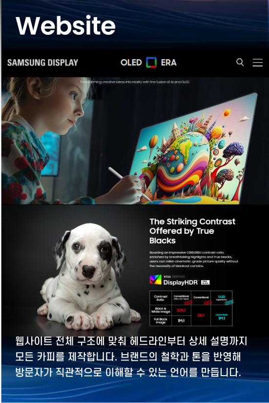
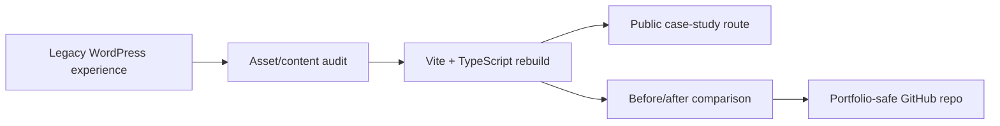

# sticksandstones.kr

근무하면서 맡았던 Sticks & Stones 웹사이트 리빌드와 before/after 비교 작업을 포트폴리오용으로 정리한 공개 레포지토리입니다. 회사 내부 WordPress 소스와 운영 히스토리는 공개하지 않고, 공개 가능한 정적 자산과 Vite/TypeScript 리빌드 결과만 분리했습니다.

## Why I Built It / 만든 이유

The site relied on a decade-old WordPress setup tangled with patches from different developers over the years, making routine maintenance practically impossible. I took the initiative to migrate the entire frontend, which directly led to a contract extension. Since proprietary code cannot be shared, this repository is a case study documenting the architectural choices and before/after results.

10년 가까이 서로 다른 개발자들의 패치가 누적된 오래된 WordPress 사이트라 코드베이스가 심각하게 엉켜 있었고, 단순 유지보수로는 감당이 안 되는 상태였습니다. 결국 프론트엔드를 직접 새로 마이그레이션했고, 그 성과로 계약 연장까지 이어졌습니다. 원본 코드는 비공개라 기술적 판단과 before/after 결과를 정리한 case study로 재구성했습니다.

[Live Site](https://stks.oosu.dev) · [Case Study](https://stks.oosu.dev/case-study) · [Before/After](https://stks.oosu.dev/live-compare)



## Project Focus

- 오래된 WordPress 기반 사이트의 브랜드 톤, 콘텐츠 구조, 모션 흐름을 보존하면서 Vite + TypeScript 기반 정적 프론트엔드로 재구성했습니다.
- 원본 회사 repo와 WordPress 런타임을 공개하지 않고도 작업 범위와 기술 판단을 설명할 수 있도록 case-study route를 만들었습니다.
- 리빌드 전/후를 한 화면에서 비교하는 `/live-compare` 화면을 별도로 구성했습니다.
- 포트폴리오/클라이언트/팀/서비스 데이터를 소스 코드에서 탐색 가능한 구조로 정리했습니다.
- 배포 링크는 Vercel legacy가 아니라 현재 홈서버 도메인인 `stks.oosu.dev` 기준으로 정리했습니다.

## Screenshots

| Case study | Live comparison |
| --- | --- |
|  |  |

| Legacy preview | Rebuilt portfolio assets |
| --- | --- |
|  |  |

| Services | Clients |
| --- | --- |
|  |  |

| Brand story | Website work |
| --- | --- |
|  |  |

## Portfolio Routes

| Route | Purpose |
| --- | --- |
| `/` | 공개 포트폴리오용 migration summary landing |
| `/case-study` | 리빌드 배경, 제약, 결과를 설명하는 case-study 화면 |
| `/live-compare` | legacy preview와 rebuild 결과를 비교하는 before/after 화면 |
| `/legacy-live` | 실제 회사 소스를 노출하지 않는 legacy-style 비교용 preview |

## Architecture

```text
sticksandstones.kr/
├── src/
│   ├── main.ts                 # entry and route bootstrap
│   ├── runtime/original.ts     # restored public-site runtime facade
│   ├── caseStudy.ts            # case-study route
│   ├── liveCompare.ts          # before/after comparison route
│   ├── legacyLive.ts           # public legacy-style preview route
│   ├── components/             # extracted UI modules
│   ├── data/                   # portfolio, team, service, FAQ data
│   └── sync/                   # comparison frame sync helpers
├── public/
│   └── assets/                 # public-safe brand, service, portfolio assets
└── docs/                       # migration and source notes
```



## Public Sharing Boundary

이 레포지토리는 공개 포트폴리오 제출용입니다. 원본 `sticksandstones` 회사 자산 repo, WordPress DB, LocalWP runtime, `wp-config.php`, 운영 로그, credential, 내부 작업 히스토리는 포함하지 않습니다.

공개 repo에 남기는 범위:

- 공개 웹사이트에서 확인 가능한 정적 이미지와 설명 자료
- Vite/TypeScript 리빌드 코드
- before/after 비교를 위한 synthetic legacy preview
- migration 과정과 아키텍처를 설명하는 문서

공개 repo에서 제외하는 범위:

- WordPress core/plugin/theme 원본 전체
- 회사 내부 repo history
- DB dump, 운영 로그, credential, salts, secret key
- 비공개 클라이언트 자료나 내부 검토 문서

## Run Locally

```bash
npm install
npm run dev
```

Open:

```text
http://127.0.0.1:4173/
http://127.0.0.1:4173/case-study
http://127.0.0.1:4173/live-compare
http://127.0.0.1:4173/legacy-live
```

## Validate

```bash
npm run build
```

## Architecture & Topics / 아키텍처 및 주제

**Architecture / 아키텍처**<br>
[`legacy-modernization`](https://github.com/topics/legacy-modernization) · [`component-based-architecture`](https://github.com/topics/component-based-architecture) · [`static-site-architecture`](https://github.com/topics/static-site-architecture) · [`progressive-enhancement`](https://github.com/topics/progressive-enhancement) · [`responsive-design-system`](https://github.com/topics/responsive-design-system) · [`asset-pipeline`](https://github.com/topics/asset-pipeline) · [`separation-of-concerns`](https://github.com/topics/separation-of-concerns)

**Core technologies / 핵심 기술**<br>
[`wordpress-migration`](https://github.com/topics/wordpress-migration) · [`gsap`](https://github.com/topics/gsap)

**Project context / 프로젝트 맥락**<br>
[`accessibility`](https://github.com/topics/accessibility) · [`case-study`](https://github.com/topics/case-study) · [`frontend`](https://github.com/topics/frontend) · [`frontend-development`](https://github.com/topics/frontend-development) · [`migration`](https://github.com/topics/migration) · [`performance`](https://github.com/topics/performance) · [`responsive-design`](https://github.com/topics/responsive-design) · [`web-development`](https://github.com/topics/web-development) · [`website`](https://github.com/topics/website)

**Implementation stack / 구현 스택**<br>
[`react`](https://github.com/topics/react) · [`typescript`](https://github.com/topics/typescript) · [`vite`](https://github.com/topics/vite) · [`wordpress`](https://github.com/topics/wordpress)
