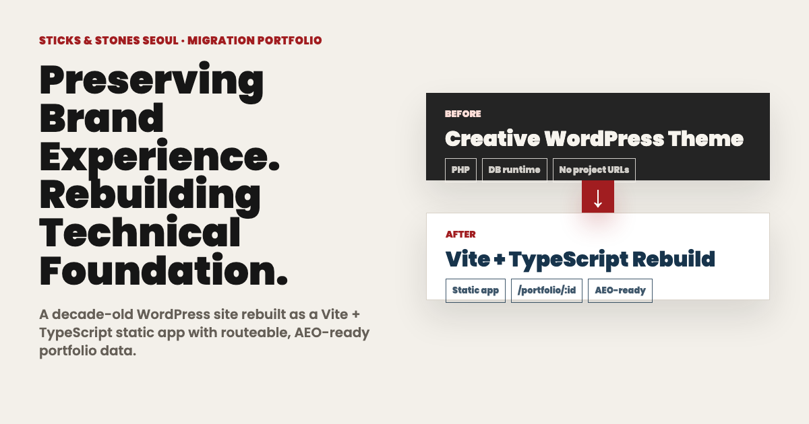

# Sticks & Stones Seoul Rebuild Case Study

Portfolio-safe rebuild and comparison site for the Sticks & Stones Seoul website. The original company/WordPress repository stays private; this project exists to show the technical migration work: extracting a legacy one-page WordPress experience, rebuilding it as a source-controlled Vite/TypeScript site, and presenting a before/after comparison view.

[Live site](https://stks.oosu.dev) · [Comparison route](https://stks.oosu.dev/case-study)



## What This Shows

- Recovered and organized a legacy WordPress visual system into a maintainable frontend codebase.
- Rebuilt the current public website with Vite, TypeScript, React-compatible tooling, GSAP motion, and structured data modules.
- Added a portfolio case-study route that explains the migration decisions instead of exposing the private company source history.
- Built a live comparison mode that can synchronize old/new sections, project drawers, contact states, and route displays.
- Kept the original WordPress runtime, database, credentials, logs, and full upload history out of the public portfolio repo.

## Architecture

```text
sticksandstones.kr/
├── src/
│   ├── main.ts                 # route switcher
│   ├── runtime/original.ts     # restored current-site runtime
│   ├── data/                   # typed portfolio/team/service/contact data
│   ├── caseStudy.ts            # portfolio migration narrative page
│   ├── liveCompare.ts          # before/after synchronized comparison
│   └── components/             # extracted UI components
├── public/
│   ├── assets/                 # current public website assets
│   └── legacy/                 # selected legacy visuals for explanation
└── docs/                       # source and versioning notes
```

## Portfolio Routes

| Route | Purpose |
| --- | --- |
| `/` | Rebuilt current website |
| `/case-study` | Migration narrative for portfolio review |
| `/live-compare` | Interactive before/after comparison using the synthetic legacy preview |
| `/legacy-live` | Lightweight legacy-style preview used by the public comparison |

## Public Sharing Boundary

The original `oosuhada/sticksandstones` repository should remain private because its `main` history contains WordPress runtime material and company-owned source context. A public portfolio repository should be created from a sanitized export of this folder only, without the private WordPress repo history.

This public export intentionally excludes `archive/legacy-wordpress/` and `public/legacy-wp/`; the case-study and comparison routes use only the checked-in static frontend, selected legacy visuals, and the synthetic `/legacy-live` comparison route.

Keep out of public git:

- LocalWP runtime files, database dumps, logs, and `wp-config.php`
- Full WordPress core/plugin source unless explicitly needed for a static comparison fixture
- Private client materials not already intended for the public website
- Any credentials, salts, API keys, or deploy-only host files

## Run Locally

```bash
npm install
npm run dev
```

Open:

```text
http://127.0.0.1:3000/
http://127.0.0.1:3000/case-study
http://127.0.0.1:3000/live-compare
```

## Validate

```bash
npm run build
```
